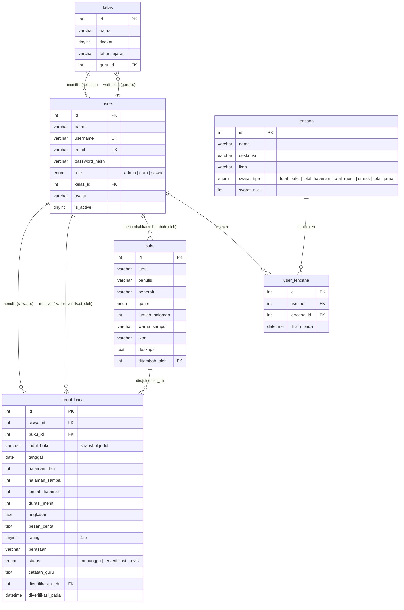

# BacaYuk! — Jurnal Membaca Anak

Aplikasi web jurnal membaca untuk siswa sekolah dasar. Siswa mencatat bacaan hariannya, guru memverifikasi dan memberi catatan, dan admin mengelola pengguna, kelas, serta katalog buku. Dilengkapi gamifikasi — streak membaca, rating bintang, lencana otomatis, dan peringkat kelas — agar kebiasaan membaca terasa seperti permainan.

Dibuat untuk Kelas IV SDN Grogol Utara 09, Jakarta, dan dipakai juga sebagai media pemantau literasi kelas oleh wali kelas.

**Demo langsung:** https://bacayuk.rf.gd
**Repositori:** https://github.com/Rizki2629/bacayuk

## Tangkapan Layar

> Dokumentasi visual — tangkapan layar dapat ditambahkan ke folder `docs/screenshots/`.

| Halaman | Keterangan |
|---|---|
| `docs/screenshots/login.png` | Halaman masuk — panel sambutan + formulir login + panel akun demo |
| `docs/screenshots/dashboard-siswa.png` | Dashboard siswa — hero misi membaca, 4 kartu statistik, grafik 7 hari, lencana & jurnal terakhir |
| `docs/screenshots/jurnal.png` | Jurnal Saya — daftar jurnal dengan status verifikasi (menunggu / terverifikasi / revisi) |
| `docs/screenshots/katalog.png` | Katalog Buku — kartu buku per genre dengan sampul berwarna |
| `docs/screenshots/lencana.png` | Lencana Saya — lencana yang diraih (ubin emas) dan progres lencana berikutnya |
| `docs/screenshots/peringkat.png` | Peringkat Kelas — papan peringkat dengan chip medali 1–3 |
| `docs/screenshots/dashboard-guru.png` | Dashboard guru — statistik kelas, grafik kelas, jurnal terbaru, siswa terajin |
| `docs/screenshots/verifikasi.png` | Verifikasi Jurnal — antrean jurnal menunggu persetujuan guru |
| `docs/screenshots/dashboard-admin.png` | Dashboard admin — 8 kartu statistik global, daftar kelas, aktivitas terbaru |

## Fitur per Role

### Siswa
- **Dashboard** — hero misi membaca, statistik (buku dibaca, total halaman, menit membaca, hari beruntun/streak), grafik aktivitas 7 hari, lencana terbaru, dan jurnal terakhir.
- **Jurnal Saya** — tambah/edit/hapus jurnal: pilih buku dari katalog atau tulis judul bebas, tanggal, halaman dari–sampai, durasi, ringkasan, pesan cerita, rating bintang 1–5, dan emoji perasaan. Jurnal yang sudah terverifikasi terkunci (tidak bisa diubah/dihapus).
- **Popup perayaan** setiap selesai menyimpan jurnal.
- **Katalog Buku** — jelajahi buku per genre (Dongeng, Sains, Puisi, Cerita Rakyat, Komik, Novel Anak, Agama, Lainnya) dan langsung mulai membaca dari kartu buku.
- **Lencana Saya** — lencana yang sudah diraih beserta progres menuju lencana berikutnya.
- **Peringkat Kelas** — papan peringkat kelas berdasarkan jurnal terverifikasi.

### Guru
- **Dashboard kelas** — jumlah siswa, jurnal 7 hari terakhir, antrean verifikasi, grafik menit membaca kelas, jurnal terbaru, dan siswa terajin.
- **Verifikasi Jurnal** — setujui jurnal atau kembalikan sebagai revisi, dengan catatan penyemangat untuk siswa. Menyetujui jurnal memicu pemeriksaan lencana otomatis bagi siswa.
- **Semua Jurnal** — riwayat jurnal seluruh siswa di kelasnya.
- **Siswa Kelas** — daftar siswa beserta progres membacanya.
- **Katalog Buku** — tambah/edit/hapus buku (dibagi bersama admin).
- **Peringkat Kelas** — papan peringkat yang sama seperti tampilan siswa.

### Admin
- **Dashboard global** — total user, guru, siswa, kelas, buku, jurnal, antrean verifikasi, dan definisi lencana; daftar kelas dan aktivitas jurnal terbaru.
- **Kelola User** — tambah/edit/nonaktifkan pengguna untuk ketiga role.
- **Kelola Kelas** — buat kelas dan tunjuk wali kelas (guru).
- **Katalog Buku** — kelola bersama guru.
- **Monitoring Jurnal** — melihat seluruh jurnal dari semua kelas.
- **Definisi Lencana** — melihat daftar lencana dan syarat perolehannya.

> Statistik, streak, peringkat, dan lencana **hanya** dihitung dari jurnal berstatus `terverifikasi`.

## Tumpukan Teknologi

| Lapisan | Teknologi |
|---|---|
| Backend | PHP 8.2+, [CodeIgniter 4.7](https://codeigniter.com) |
| Database | MySQL 8 / MariaDB 10.6+ (pengujian lokal juga bisa memakai SQLite 3) |
| Frontend | Tailwind CSS (Play CDN build, disimpan lokal), [DaisyUI 4](https://daisyui.com), Plus Jakarta Sans + DM Sans |
| Grafik | Chart.js 4 |
| Ilustrasi | SVG dari [unDraw](https://undraw.co) (lihat bagian Lisensi & Kredit) |
| Autentikasi | Sesi CodeIgniter + filter role (`admin` / `guru` / `siswa`) + proteksi CSRF |

Seluruh aset frontend (Tailwind, DaisyUI, Chart.js, font, ilustrasi) tersimpan lokal di `public/assets/` — aplikasi tidak bergantung pada CDN saat berjalan.

## Arsitektur Singkat

```
app/
├── Config/Routes.php        Grup rute per role, dilindungi filter `role:*`
├── Controllers/
│   ├── Auth.php             Login/logout berbasis username + sesi
│   ├── Siswa.php            Dashboard, jurnal, katalog, lencana, peringkat
│   ├── Guru.php             Dashboard kelas, verifikasi, daftar siswa
│   ├── Buku.php             CRUD katalog buku (guru & admin)
│   └── Admin.php            Dashboard global, user, kelas, monitoring
├── Models/
│   ├── JurnalModel.php      Statistik, streak, grafik 7 hari, leaderboard,
│   │                        dan mesin lencana otomatis (`periksaLencana()`)
│   ├── UserModel.php · KelasModel.php · BukuModel.php
│   └── LencanaModel.php · UserLencanaModel.php
├── Views/                   layout/main + halaman per role (Tailwind + DaisyUI)
├── Filters/                 Filter autentikasi & role
└── Database/
    ├── Migrations/          6 migrasi tabel
    └── Seeds/BacaYukSeeder.php   Data demo (kelas, user, buku, jurnal, lencana)
```

Alur inti: siswa mengisi jurnal → status `menunggu` → guru menyetujui (`terverifikasi`) atau meminta `revisi` + catatan → saat terverifikasi, sistem menghitung ulang statistik, streak, dan lencana siswa.

### Skema Database



Catatan skema: judul buku disimpan sebagai *snapshot* di `jurnal_baca.judul_buku`, sehingga jurnal tetap utuh walau buku dihapus dari katalog (`buku_id` menjadi `NULL`). Menghapus user siswa menghapus jurnalnya (`ON DELETE CASCADE`). Skema lengkap ada di [`database/bacayuk.sql`](database/bacayuk.sql).

## Instalasi Lokal

Syarat: PHP 8.2+ (ekstensi `intl`, `mbstring`, `mysqli`, `curl`, `xml`), MySQL 8 / MariaDB, dan Composer (untuk memulihkan folder `vendor/` bila belum ada).

```bash
# 1. Ambil kode
git clone https://github.com/Rizki2629/bacayuk.git
cd bacayuk
composer install            # lewati bila folder vendor/ sudah ada

# 2. Buat database
mysql -u root -p -e "CREATE DATABASE bacayuk CHARACTER SET utf8mb4 COLLATE utf8mb4_unicode_ci;"

# 3. Konfigurasi environment
cp env .env                 # lalu sesuaikan bagian database.default.* dengan kredensial lokalmu

# 4. Buat tabel + isi data demo
php spark migrate --all
php spark db:seed BacaYukSeeder

# 5. Jalankan
php spark serve             # http://localhost:8080
```

Alternatif tanpa migrasi: impor [`database/bacayuk.sql`](database/bacayuk.sql) ke MySQL (membuat database, tabel, dan definisi lencana), lalu tetap jalankan `php spark db:seed BacaYukSeeder` untuk akun demo dan data contoh.

**Demo cepat tanpa MySQL (SQLite):** arahkan `.env` ke SQLite —

```
database.default.database = /path/ke/proyek/writable/bacayuk.sqlite3
database.default.DBDriver = SQLite3
database.default.hostname =
database.default.username =
database.default.password =
```

lalu ulangi langkah 4–5 di atas.

## Akun Demo

Login memakai **username** (bukan email) agar mudah diingat anak. Akun-akun ini juga tampil di panel demo pada halaman login situs.

| Role | Username | Password |
|---|---|---|
| Admin | `admin` | `admin123` |
| Guru (wali Kelas 4A) | `guru` | `guru123` |
| Siswa (demo utama) | `siswa` | `siswa123` |
| Siswa contoh lain | `bima`, `citra`, `dimas`, `eka`, `fajar`, `gita`, `hadi` | `siswa123` |

> ⚠️ Ganti semua kata sandi demo sebelum aplikasi dipakai sungguhan.

## Deployment

Situs demo berjalan di hosting gratis InfinityFree. Panduan lengkap deploy ulang maupun memasang patch pembaruan ada di [`docs/DEPLOY-INFINITYFREE.md`](docs/DEPLOY-INFINITYFREE.md).

## Lisensi & Kredit

- Kode aplikasi dirilis dengan lisensi MIT — lihat berkas [`LICENSE`](LICENSE).
- Ilustrasi SVG berasal dari [unDraw](https://undraw.co) (lisensi unDraw: bebas digunakan untuk keperluan pribadi maupun komersial, tanpa kewajiban atribusi) dan diwarnai ulang mengikuti palet aplikasi. Berkasnya ada di `public/assets/ilustrasi/`.
- Arah desain awal dirumuskan di [`KONSEP.md`](KONSEP.md) (referensi dari ui.live). Tampilan saat ini adalah hasil *redesign* bergaya premium (palet ungu `#6956E8` + emas, tipografi Plus Jakarta Sans + DM Sans) yang dibuat dengan bantuan Manus, lalu diterapkan dan diselaraskan ke seluruh halaman.
- Font: Plus Jakarta Sans dan DM Sans (Google Fonts, lisensi OFL).
